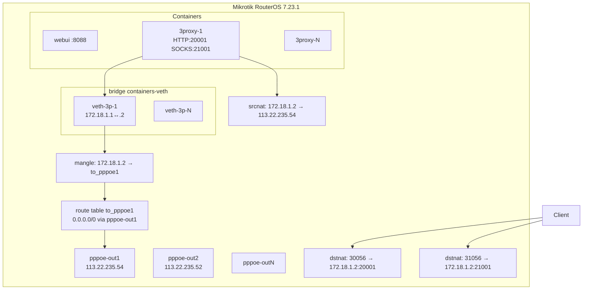

# webuiproxymikrotik

[](https://github.com/clonethinh/mikrotik-x86-proxy-container/actions/workflows/ci.yml)

**WebUI toàn diện để quản lý & tạo proxy trên MikroTik RouterOS v7 Container + 3proxy.**

> 📦 **GitHub:** https://github.com/clonethinh/mikrotik-x86-proxy-container  
> Clone nhanh:
> ```bash
> git clone https://github.com/clonethinh/mikrotik-x86-proxy-container.git
> cd mikrotik-x86-proxy-container
> ```

---

WebUI toàn diện để quản lý & tạo proxy trên MikroTik RouterOS v7 Container + 3proxy.

## Tổng quan

Mỗi PPPoE client (`pppoe-outN`) trên Mikrotik = **1 proxy riêng** (HTTP + SOCKS5) với IP public của chính PPPoE đó. Toàn bộ stack (backend Fastify + frontend React + nhiều container 3proxy) chạy ngay trên router, không cần VPS ngoài.

## Kiến trúc

```
┌────────────────────────────────────────────────────────┐
│ Mikrotik RouterOS 7.23.1 (x86_64)                      │
│ ┌────────────────────────────────────────────────────┐ │
│ │ Container feature                                 │ │
│ │  ┌─────────────┐ ┌──────────┐ ┌──────────┐         │ │
│ │  │ webui       │ │ proxy3p-1│ │ proxy3p-N│         │ │
│ │  │ Fastify+    │ │ 3proxy   │ │ 3proxy   │         │ │
│ │  │ React WS    │ │ HTTP:    │ │          │         │ │
│ │  │ port 8088   │ │ 2000N    │ │          │         │ │
│ │  │             │ │ SOCKS:   │ │          │         │ │
│ │  │             │ │ 2100N    │ │          │         │ │
│ │  └──────┬──────┘ └────┬─────┘ └────┬─────┘         │ │
│ │ bridge containers-veth (172.17/16 + 172.18.N.1/30)  │ │
│ │ + /disk1/users-N.json (mount, persistent)          │ │
│ └────────────────────────────────────────────────────┘ │
└────────────────────────────────────────────────────────┘
```

### Network flow (mỗi proxy)

```
Client → WAN_IP:30055+N (Mikrotik) → dst-nat → 172.18.N.2:2000N (container)
                                          ↓
                                    3proxy bind 0.0.0.0
                                          ↓
                          mangle mark-routing (to_pppoeN)
                                          ↓
                            routing table to_pppoeN
                                          ↓
                                   pppoe-outN (WAN)
                                          ↓
                                    srcnat rewrite IP
                                          ↓
                                IP public của pppoe-outN ra internet
```

## Sơ đồ mạng chi tiết (Mermaid)



## Tech stack

| Layer | Tech |
|-------|------|
| Frontend | React 18 + TypeScript + Vite + **Ant Design v6.5.0** + WebSocket |
| Backend | Node.js + TypeScript + Fastify + Prisma + SQLite + ssh2 + JWT + argon2 |
| Realtime | WebSocket (custom hub) — broadcast WAN/IP/health/audit |
| Deploy | Docker multi-arch + RouterOS v7 Container feature |
| 3proxy | `ghcr.io/tarampampam/3proxy:2` (mỗi container = 1 proxy) |

## Cấu trúc repo

```
webuiproxymikrotik/
├── backend/                    # Fastify + TypeScript
│   ├── src/
│   │   ├── server.ts           # main entry
│   │   ├── lib/                # config, logger, validation, queue
│   │   ├── db/prisma.ts        # Prisma singleton
│   │   ├── services/
│   │   │   ├── mikrotik/       # REST API + SSH client
│   │   │   ├── proxy/          # CRUD + idempotent router ops
│   │   │   ├── auth/           # JWT + argon2
│   │   │   ├── export/         # 6 format export
│   │   │   └── realtime/       # Health monitor
│   │   ├── routes/             # auth, proxies, system
│   │   ├── realtime/hub.ts     # WS broadcast hub
│   │   ├── ws/handler.ts       # WS endpoint
│   │   └── middleware/auth.ts
│   ├── prisma/schema.prisma    # DB schema
│   └── .env.example            # ENV template
├── frontend/                   # React + antd v6
│   ├── src/
│   │   ├── App.tsx             # Router + auth guard
│   │   ├── pages/              # Login, Dashboard, Proxies, WAN, Audit, Settings
│   │   ├── components/         # AppLayout
│   │   ├── services/           # API client + auth store
│   │   └── hooks/useWebSocket  # Auto-reconnect WS
│   └── vite.config.ts
├── mikrotik/                   # RouterOS .rsc scripts (idempotent)
│   ├── install-all.rsc         # chạy tất cả
│   ├── ensure-bridge.rsc
│   ├── ensure-veth-for-pppoe.rsc
│   ├── ensure-routing.rsc      # routing table + mangle + srcnat
│   ├── ensure-dstnat.rsc       # dst-nat HTTP + SOCKS
│   ├── ensure-firewall.rsc     # filter accept-proxy-range
│   ├── reload-ip-pppoe.rsc     # trigger dial lại
│   └── cleanup-proxy.rsc       # xoá ngược (veth + NAT + container)
├── scripts/
│   └── upload-to-mikrotik.sh   # SCP scripts lên /disk1/
├── docs/                       # (architecture diagrams, troubleshooting)
├── Dockerfile                  # Multi-stage build FE+BE
├── docker-compose.yml          # Dev compose (DEPLOY_TARGET=external)
└── README.md                   # ← bạn đang đọc
```

## Cài đặt

### Option A: Chạy trên Mikrotik (recommended, deploy_target=router)

Yêu cầu:
- Mikrotik RouterOS 7.4+ với package `container` đã cài
- Disk có ít nhất 2GB trống (image + extracted + DB)
- Quyền admin

Bước 1: Upload scripts
```bash
MIK_PASS=toanthinh ./scripts/upload-to-mikrotik.sh
```

Bước 2: Chạy install-all trên Mikrotik
```bash
ssh admin@<mikrotik>
/import file=disk1/webuiproxymikrotik/install-all.rsc
```
→ Tạo bridge, veth, routing tables, mangle, NAT rules, firewall. **Idempotent**, chạy lại OK.

Bước 3: Build image webui
```bash
cd webuiproxymikrotik
docker buildx build --platform linux/amd64 -t webuiproxymikrotik:latest .
docker save webuiproxymikrotik:latest > webuiproxymikrotik.tar
scp webuiproxymikrotik.tar admin@<mikrotik>:/disk1/
```

Bước 4: Tạo container webui trên Mikrotik
```bash
ssh admin@<mikrotik>
/container/envlist/add name=ENV_WEBUI key=MIKROTIK_HOST value="127.0.0.1"
/container/envlist/add name=ENV_WEBUI key=MIKROTIK_API_USER value="admin"
/container/envlist/add name=ENV_WEBUI key=MIKROTIK_API_PASS value="toanthinh"
/container/envlist/add name=ENV_WEBUI key=MIKROTIK_SSH_PASS value="toanthinh"
/container/envlist/add name=ENV_WEBUI key=MIKROTIK_WAN_IP value="113.22.235.52"
/container/envlist/add name=ENV_WEBUI key=JWT_SECRET value="change-me-in-prod"
/container/envlist/add name=ENV_WEBUI key=ADMIN_PASSWORD value="changeme123"
/container/envlist/add name=ENV_WEBUI key=DATABASE_URL value="file:/data/proxy.db"
/container/mounts/add list=MOUNT_DATA src=disk1/data dst=/data

/container/add file=disk1/webuiproxymikrotik.tar \
    interface=veth-webui \
    root-dir=disk1/webuiproxymikrotik-root \
    name=webuiproxymikrotik \
    envlist=ENV_WEBUI \
    mountlists=MOUNT_DATA \
    logging=yes

:delay 60s
/container/start webuiproxymikrotik
```

Bước 5: Mở WebUI
→ http://`<mikrotik_wan_ip>`:8088

### Option B: Backend chạy ngoài (host/VPS, fallback)

```bash
cp backend/.env.example backend/.env
# Sửa MIKROTIK_HOST=<public_ip>, MIKROTIK_*_PASS=<password>
cd backend && npm install && npm run build && npm start

# Frontend dev
cd frontend && npm install && npm run dev  # http://localhost:5173
```

Hoặc Docker:
```bash
docker compose up -d
```

## Tính năng chính

### CRUD Proxy
- Tạo: chọn pppoe-outN → tự sinh port/user/pass → idempotent setup veth + routing + NAT + container + start
- Sửa: enabled, loại, user/pass, ghi chú
- Xoá: cleanup toàn bộ (veth, NAT, container, mount)
- Bulk: chọn nhiều → start/stop/reload/test/delete/export cùng lúc

### Reload IP
- Trigger PPPoE reconnect (KHÔNG disable pppoe-out1)
- Polling IP mới (timeout 30s)
- Cập nhật srcnat to-addresses tự động
- Realtime push qua WebSocket khi có IP mới

### Test / Health check
- `/tool fetch` từ Mikrotik tới api.ipify.org qua proxy → đo latency + IP thoát
- Lưu HealthCheck rows
- Auto-check mỗi 60s (background monitor)
- Realtime push `proxy.health` events

### Export (6 định dạng)
- `ip:port:user:pass`
- `user:pass@ip:port`
- `http://user:pass@ip:port`
- `socks5://user:pass@ip:port`
- `ip:port` (no auth)
- Template tự do: `{scheme}://{user}:{pass}@{ip}:{port}`
- Output: copy clipboard / .txt / .csv / .json

### Định tuyến thiết bị LAN
- Gán thiết bị (IP / MAC / DHCP lease) → egress traffic đi ra `pppoe-outN`
- Mangle rule `comment=dev-route-<id>` idempotent
- Trang **Thiết bị** trong WebUI: chọn lease, chọn WAN, bật/tắt realtime

### Realtime (WebSocket)
- `proxy.created` `proxy.updated` `proxy.deleted`
- `proxy.status` (running/stopped/error)
- `proxy.ip-changed`
- `proxy.health`
- `proxy.reloading`
- `wan.sync`
- Auto-reconnect client với buffer replay
- Token auth qua query string

### Security
- argon2id password hash
- JWT có hạn
- Rate limit login (10/min)
- Helmet + CORS
- Pass proxy ẩn mặc định, chỉ hiện khi bấm (audit-logged)
- Input sanitization cho RouterOS commands
- pppoe-out1 hard guard (KHÔNG bao giờ disable)

## Quy ước đặt tên

| Lớp | Pattern |
|-----|---------|
| `veth` | `veth-3p-N` |
| Container IP | `172.18.N.2/30` |
| Gateway IP | `172.18.N.1/30` |
| Routing table | `to_pppoeN` |
| Container name | `proxy3p-N` |
| Mount list | `MOUNT_PROXY_N` |
| Env list | `ENV_3PROXY_N` |
| External HTTP port | `30055 + N` (past 30000-30054 broken range) |
| External SOCKS port | `31055 + N` |
| Internal HTTP port | `20000 + N` |
| Internal SOCKS port | `21000 + N` |

## API Reference (xem file routes/proxies.ts đầy đủ)

| Method | Path | Mô tả |
|--------|------|-------|
| POST | `/api/auth/login` | Login → JWT |
| GET | `/api/auth/me` | Current user |
| POST | `/api/auth/change-password` | Đổi pass |
| GET | `/api/proxies` | List (search, status filter) |
| GET | `/api/proxies/:id` | Detail + IP history + health history |
| POST | `/api/proxies` | Create |
| PATCH | `/api/proxies/:id` | Update |
| DELETE | `/api/proxies/:id` | Delete (cleanup router) |
| POST | `/api/proxies/:id/start` | Start container |
| POST | `/api/proxies/:id/stop` | Stop container |
| POST | `/api/proxies/:id/reload-ip` | PPPoE reconnect + update srcnat |
| POST | `/api/proxies/:id/test` | Health check |
| POST | `/api/proxies/bulk` | Bulk action |
| POST | `/api/proxies/regenerate-credentials` | Random new password cho list |
| POST | `/api/proxies/export` | Export nhiều format |
| GET | `/api/proxies/:id/ip-history` | Lịch sử IP |
| GET | `/api/proxies/:id/health-history` | Lịch sử health check |
| GET | `/api/dashboard` | Stats |
| GET | `/api/wan` | WAN status + proxy mapping |
| GET | `/api/devices` | Device routing list |
| GET | `/api/devices/dhcp-leases` | DHCP leases từ Mikrotik |
| POST | `/api/devices` | Tạo device route |
| PATCH | `/api/devices/:id` | Sửa / bật tắt |
| DELETE | `/api/devices/:id` | Xóa + cleanup mangle |
| GET | `/api/audit` | Audit log |
| GET | `/api/mikrotik/system` | Resource + containers |
| GET | `/api/deploy-info` | Deploy config |
| WS | `/ws` | Realtime |

## Edge cases đã handle

- **PPPoE down khi reload**: timeout 30s + trả về `'TIMEOUT'` + log rõ
- **Container chết**: stop retries 3x + verify gone
- **Trùng port**: validate unique trước khi tạo
- **Mất SSH/REST**: try/catch + audit log + UI degraded
- **Nhiều thao tác đồng thời**: `routerQueue` serialize writes
- **WebSocket rớt**: auto-reconnect + resync (Dashboard refresh)
- **pppoe-out1**: HARD guard — không disable bao giờ
- **Port 30000-30054 broken**: dùng 30055+N (verified)
- **Container root-dir lock**: mỗi idx có `disk1/3proxy-pN` riêng

## Troubleshooting

### Backend không start: "table AdminUser does not exist"
- Auto-fix: set `NODE_ENV=production` để chạy `prisma db push` lúc khởi động
- Hoặc manual: `DATABASE_URL=file:/data/proxy.db npx prisma db push`

### Port 8088 không bind được
- Đổi `PORT` trong `.env.production` (skill note: port 8080 có ghost binding issue)

### Container không start được (status `E` error)
- Check `/log print` xem lỗi gì
- Verify `/disk1/users-N.json` tồn tại (mount MOUNT_PROXY_N phải tạo TRƯỚC)
- Verify image `disk1/3proxy.tar` đã pull về

### Veth có nhưng container ping không ra
- Veth chưa add vào bridge: `/interface/bridge/port/add bridge=containers-veth interface=veth-3p-N`
- IP gateway chưa add trên bridge

### PPPoE reconnect nhưng proxy vẫn ra IP cũ
- Wait 60s TIME_WAIT
- Check srcnat rule `to-addresses=` đã update chưa (`/ip/firewall/nat/print where comment=ctn-pppoe-outN`)

### Frontend không load được
- Check `public/` có file `index.html` không (sau `npm run build` copy vào)
- Check backend log xem có error serve static không

## Hard rule nhớ

- **pppoe-out1 = management path** — KHÔNG BAO GIỜ disable, reload IP, hay cleanup
- **External port phải ≥ 30055** — port 30000-30054 bị broken
- **Container bind `0.0.0.0`** — không dùng `-eIP` (IP_FREEBIND không hoạt động trong RouterOS namespace)
- **Idempotent mọi thứ** — chạy lại không nhân đôi rule
- **Audit log tất cả hành động** — ai/làm gì/khi nào

## License

MIT